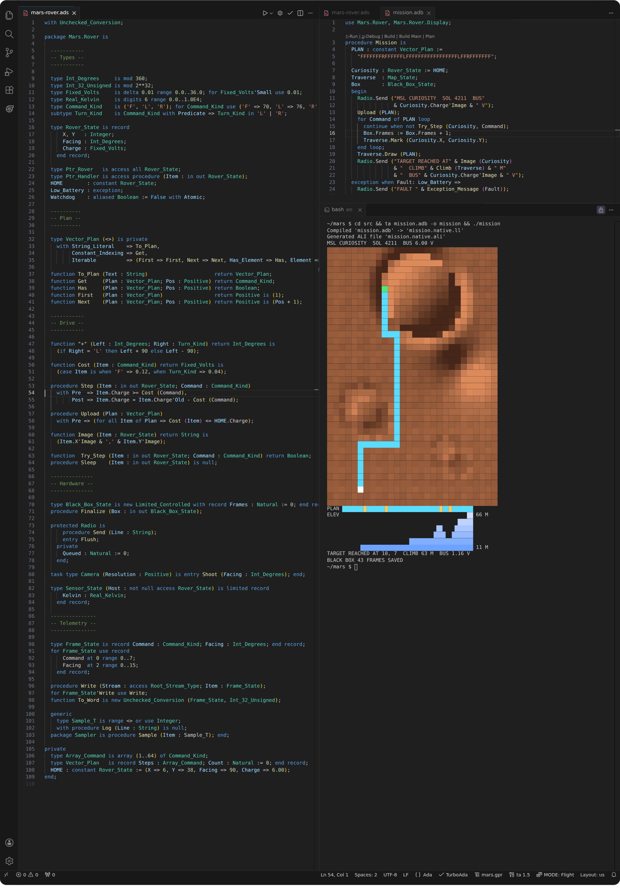
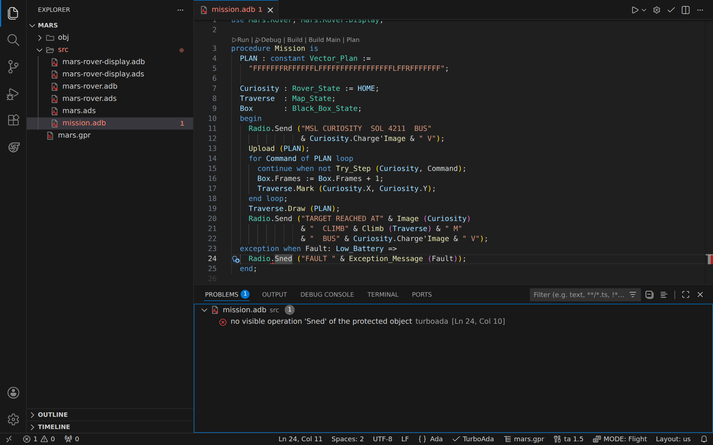
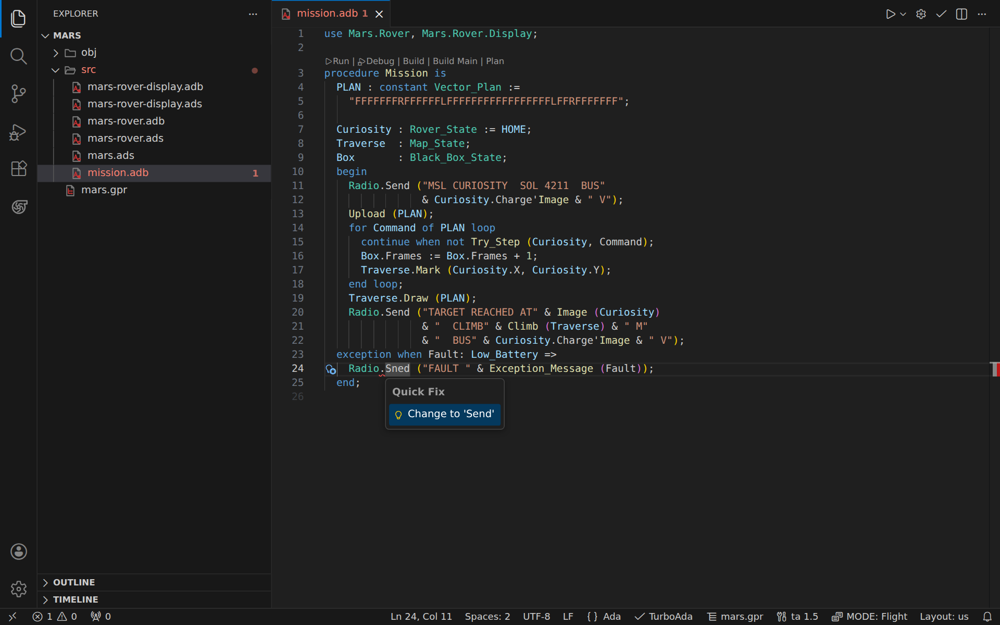
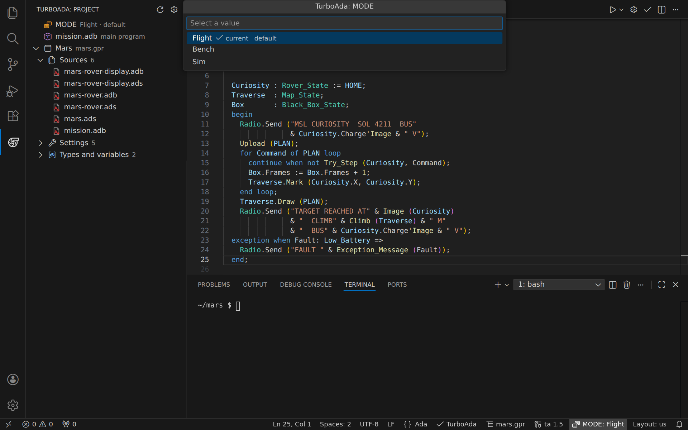
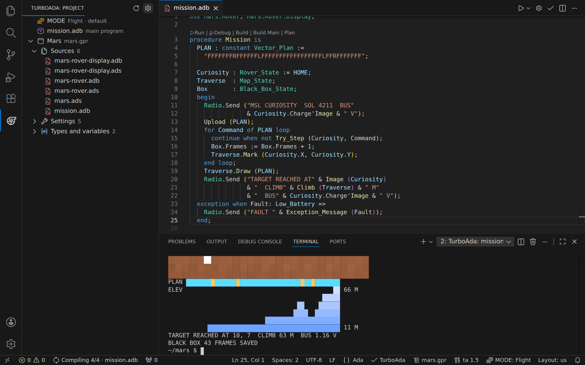
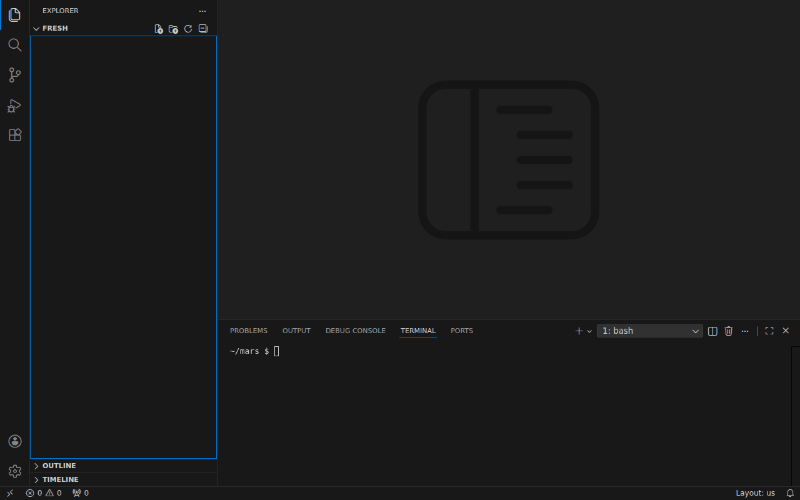
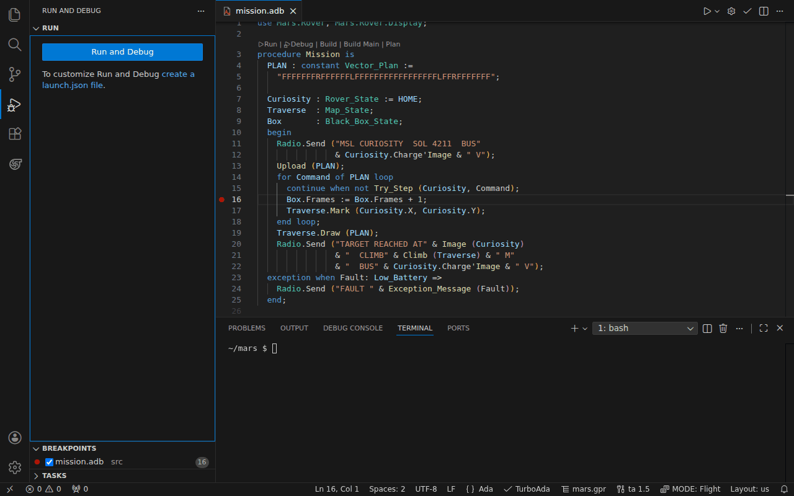

# TurboAda

[](https://github.com/AdaDoom3/Ada83/actions/workflows/ci-linux.yml)
[](https://github.com/AdaDoom3/Ada83/actions/workflows/ci-macos.yml)
[](https://github.com/AdaDoom3/Ada83/actions/workflows/ci-windows.yml)

<p align="center">
  
</p>




| | |
|---|---|
| Compiler | `turboada.c`, 113k lines, no generated code, no third-party source |
| Runtime | `turboada-runtime.ada`, 3k lines of Ada; `turboada-runtime-legacy.ada`, 14k lines of strings and containers |
| Language | all of MIL-STD-1815A: tasking, generics, fixed point, representation clauses |
| Additional features | protected types, controlled types, child units, general and anonymous access, contracts and more; `-ada83` turns them off |
| Conformance | 3561 / 3561, ACATS 1.11; 234 / 234 of the post-83 tests |
| Targets | Linux, macOS, Windows |

## Quick start

From the [latest release](https://github.com/AdaDoom3/Ada83/releases/latest),
unpack the archive for your platform: `bin-linux.zip`, `bin-macos.zip` or
`bin-windows.zip`

```ada
with Text_IO; use Text_IO;
procedure Hello is
  begin
    Put_Line ("Hello, Ada world!");
  end;
```

```
$ ./ta hello.ada -o hello
Compiled 'hello.ada' -> 'hello.native.ll'
Generated ALI file 'hello.native.ali'
$ ./hello
Hello, Ada world!
```

For the editor, install the extension that came in the same archive:

```sh
code --install-extension turboada.vsix
```

It needs `ta` on your PATH, or `turboada.compilerPath` set to where you
unpacked it.

## Building

| Platform | Command | Notes |
| -------- | ------- | ----- |
| Linux    | `make`  | GCC or Clang; installs libLLVM via the system package manager if absent |
| macOS    | `make.applescript` | Apple Clang; libLLVM via Homebrew |
| Windows  | `make.bat` | GCC or Clang; offers to fetch Zig if neither is installed |

Every script writes into `bin-<target>/` - `bin-linux/ta`,
`bin-macos/ta`, `bin-windows\ta.exe` alongside `LLVM-C.dll`. 

`turboada-runtime.ada` holds the standard library, and
`turboada-runtime-legacy.ada` the predefined string and container packages
of the later standards (`Ada.Strings.Unbounded`, `Ada.Containers.Vectors`
and the rest).

| Platform | Command | Produces |
| -------- | ------- | -------- |
| Linux    | `make package` | `builds/bin-linux.zip`, extension and artwork included |
| macOS    | `osascript make.applescript package` | `builds/bin-macos.zip`, both slices together |
| Windows  | `make.bat package` | `builds/bin-windows.zip`, `LLVM-C.dll` included |

## Conformance

Under ACATS 1.11 all 3561 tests pass

| Suite | Category | Passed | Completion |
|:-----:|----------|-------:|-----------:|
| **A** | Acceptance | `140 / 140` | **100%** ✅ |
| **B** | Illegality | `1350 / 1350` | **100%** ✅ |
| **C** | Executable | `1973 / 1973` | **100%** ✅ |
| **D** | Numerics | `17 / 17` | **100%** ✅ |
| **E** | Inspection | `34 / 34` | **100%** ✅ |
| **L** | Post-compilation | `47 / 47` | **100%** ✅ |
| | **Total** | **`3561 / 3561`** | **100%** ✅ |

The post-83 features have a suite of their own, `acats-bonus/`: ACATS 4.2
tests for each feature, cut down to Ada 83 plus the feature under test.
All 234 pass. A B-test passes only when every line it marks draws a
diagnostic.

## Additional features

These constructs from later standards are admitted by default, each
checked by its own tests. `-ada83` restricts the compiler to
ANSI/MIL-STD-1815A, and refuses them.

| Area | What is there |
|------|---------------|
| Concurrency | protected types, objects and entries, with timed and conditional entry calls and `requeue`; `delay until`; asynchronous select (`select ... then abort`); access to protected operations; task discriminants |
| Types | controlled types (`Ada.Finalization`) without tagged types; general access types, `aliased`, `'Access`; anonymous access types, access discriminants and their accessibility checks; access-to-subprogram types; subtype predicates |
| Program structure | child units, public and private, with their visibility rules; `Ada.`-prefixed names for the predefined units; a context-clause `use` that implies its `with` (as GNAT admits under `-gnatX`); prefixed (dot) calls |
| Expressions | if, case, quantified and declare expressions; raise expressions; expression functions; null procedures; user-defined literals; delta aggregates for records and arrays; iterated component associations with a choice list or `for ... of` |
| Contracts | `Pre`, `Post`, `Assert` and `Predicate`, with the aspects that carry them |
| Iteration | `for ... of` over arrays and containers; user-defined iterators; generalized references and indexing |
| Statements | `continue`, `goto ... when`, `raise ... with` and `Ada.Exceptions` |
| Generics | defaults for generic formals |
| Input-output | streams: `'Read`, `'Write`, `Stream_Size`, user streams, `Stream_IO` |
| Systems | `Volatile` and `Atomic` (RM C.6) |

Note: Tagged types and dispatching are deliberately excluded from the subset.

## Benchmarks

Run time of the generated code at `-O2`, against GNAT 13.3.0 (GCC
`13.3.0-6ubuntu2~24.04.1`), on Linux x86_64 with 4 cpus (Intel Xeon @ 2.80 GHz),
measured on 2026-09-28.

| Program | Stresses | ta (s) | gnat (s) | Ratio | Result |
|---------|----------|----------:|---------:|------:|-------:|
| **exceptions** | raise, propagate, handle | `0.030 ± 0.001` | `4.901 ± 0.125` | `0.01` | **163× faster** |
| **tasking** | rendezvous throughput | `0.927 ± 0.271` | `7.514 ± 0.307` | `0.12` | **8.1× faster** |
| **memory** | allocation and deallocation | `0.105 ± 0.001` | `0.397 ± 0.006` | `0.26` | **3.8× faster** |
| **lu** | LU decomposition, float division | `0.080 ± 0.003` | `0.241 ± 0.011` | `0.33` | **3.0× faster** |
| **finalizer** | controlled types, finalization on scope exit | `0.025 ± 0.000` | `0.050 ± 0.001` | `0.50` | **2.0× faster** |
| **taskelse** | selective wait with an else part | `0.049 ± 0.002` | `0.097 ± 0.001` | `0.51` | **2.0× faster** |
| **numerics** | fixed point and 12-digit float \* | `0.085 ± 0.001` | `0.153 ± 0.001` | `0.56` | **1.8× faster** |
| **indirect** | calls through a subprogram pointer | `0.071 ± 0.001` | `0.106 ± 0.002` | `0.67` | **1.5× faster** |
| **taskflood** | task creation and termination | `0.362 ± 0.017` | `0.467 ± 0.013` | `0.78` | **1.3× faster** |
| **checks** | range and index checks in a hot loop | `0.176 ± 0.004` | `0.208 ± 0.010` | `0.85` | **1.2× faster** |
| **wraparound** | modular arithmetic at the type's top | `0.055 ± 0.001` | `0.064 ± 0.000` | `0.86` | **1.2× faster** |
| **strings** | slices and character work | `0.059 ± 0.000` | `0.067 ± 0.002` | `0.88` | **1.1× faster** |
| **monitor** | protected object, read and update | `0.507 ± 0.006` | `0.530 ± 0.015` | — | *a tie* |
| **sieve** | integer arrays, index checks | `0.059 ± 0.000` | `0.059 ± 0.001` | — | *indistinguishable* |
| **matmul** | dense float, nested loops | `0.030 ± 0.001` | `0.029 ± 0.002` | — | *indistinguishable* |
| **recurse** | call and return | `0.022 ± 0.001` | `0.025 ± 0.001` | — | *indistinguishable* |

## VSCode Extension

| | |
|:--:|:--:|
|  |  |
| Diagnostics as you type | Quick fixes from the compiler's own suggestions |
|  |  |
| Scenario values from the status bar | Build progress in the view and the status bar |

Build and run without leaving the editor. The project view reads `.gpr`
and `.gpj` files, shows build progress unit by unit, and runs the result
in the integrated terminal.

**TurboAda: New Project** creates a project from a name: a `.gpr` with a
typed scenario variable, a `src/` directory and a main that prints a
line:



Error messages can be shown in another language. Set `turboada.language`;
anything but English is translated by the editor's language model.

| `turboada.language` | |
| ---------------- | --- |
| `en` | English, straight from the compiler |
| `es` | Spanish |
| `fr` | French |
| `de` | German |
| `zh-CN` | Chinese (Simplified) |
| `ja` | Japanese |
| `hi` | Hindi |
| `lolcat` | `O NOES 'Put_Lin' IS NOT CALLABUL. SRSLY.` |

| Setting | |
| ------- | --- |
| `turboada.compilerPath` | Path to `ta`; `${workspaceFolder}` is substituted |
| `turboada.includePaths` | Directories for with-ed units |
| `turboada.language` | Language for error messages |
| `turboada.formatOnType` | Reindent each line as you type it |
| `turboada.formatOnSave` | Reformat the whole file on save, using a language model |
| `turboada.formatStrength` | How much a reformat may change: `indentation`, `layout` or `style` |
| `turboada.trace.server` | Log the language server traffic to the output channel |

## Use

The compiler emits LLVM IR, so the IR can be taken directly:

```sh
./ta --ir hello.ada -o hello.ll      # Textual LLVM IR
./ta --emit-llvm hello.ada -o hello  # Native, keeping the optimised IR
./ta --ir a.ada b.ada c.ada          # Several units, one process each
./ta hello.ll world.ll -o hello      # Link .ll modules, no source needed
lli hello.ll                            # Interpret the IR
```

## Debugging

`-g` builds a binary every LLVM tool reads — lldb, lldb-dap — and `-ggdb`
targets gdb's Ada mode instead; either defaults the build to `-O0` unless
an explicit `-O` is given.

```sh
./ta -g hello.ada -o hello     # Debug info for lldb, lldb-dap, any LLVM tool
./ta -ggdb hello.ada -o hello  # Debug info for gdb's Ada mode
./ta --debug hello             # Debug in the terminal: ta drives lldb-dap
```

In the editor, `F5` runs `ta --dap` — the compiler is its own Debug
Adapter Protocol server via lldb-dap.



### In the terminal

```
$ ./ta --debug demo
(ta) break demo.stack.push
Breakpoint 1 at demo.ada:23
(ta) run
Stopped at demo.stack.push, demo.ada:23
   23            Total := Total + F.Depth;
(ta) bt
#0  demo.stack.push  demo.ada:23
#1  demo             demo.ada:47
(ta) print F.Label
"climb"
```

### In gdb and lldb

The same binaries debug in stock tools. `-g` is plain DWARF, so any LLVM
tool reads it:

```
$ lldb demo
(lldb) b demo.ada:23
(lldb) frame variable f
(frame) f = (depth = 3, label = "climb")
```

`-ggdb` carries the Ada language label instead, which switches gdb into its
Ada mode — aggregates, attributes, and breaks by qualified name:

```
$ gdb demo
(gdb) break demo.stack.push
(gdb) print f
$1 = (depth => 3, label => "climb")
```

## Tests

The ACATS tests along with the additional testing are in `tests.zip`.

```sh
bash test.sh         # Every test: ACATS, extensions, projects, bonus, debug, reproducers
bash test.sh run c   # One class
bash test.sh run c45 # One group
bash test.sh check   # Run, then diff against the baseline
bash test.sh bonus   # The post-83 features
bash test.sh repro   # The reproducers, judged by the headers in each file
bash test.sh fuzz    # The 6,003 generated feature-matrix tests; every one must pass
bash test.sh bench   # Measure instead of test
bash test.sh help
```

## Release Workflow

1. Update `turboada.c` with `TURBOADA_VERSION_MINOR` or `TURBOADA_VERSION_MAJOR` through a normal PR and merge to main.
2. Update git with `git tag v1.0 && git push origin v1.0`
3. Allow `release.yml` to verify the tag, build and packages all platforms and publishes.

The tag refuses to publish unless the tag matches `TURBOADA_VERSION_*` and no release exists under that tag. A tag on an unmerged branch, or one that conflicting with `TURBOADA_VERSION_*`, publishes nothing.
